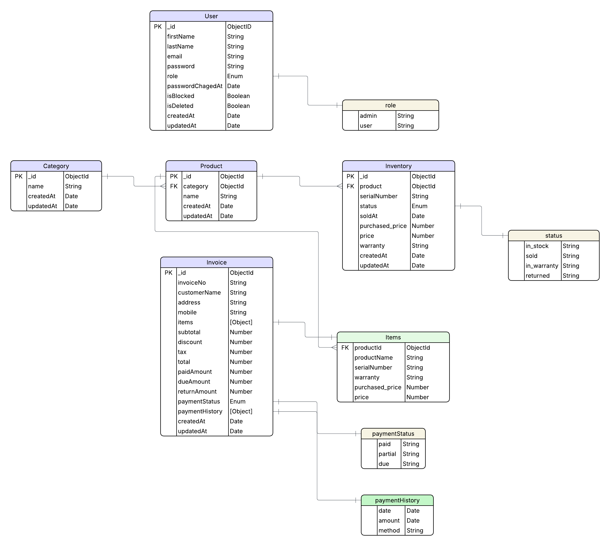

# 📦 BRHEX Inventory Management System (Frontend)

A complete inventory, sales, and invoice management system client built using **Next.js** and **TypeScript**. It provides features like barcode scanning, dynamic invoice creation, and advanced sales analytics for small to medium businesses.

[](https://brhex-inventory-management-client.vercel.app/)
[](https://docs.google.com/document/d/1ZsLyhXlbE-40RM3Avk70LvFQheMPn8ZNwq12JA5oUpc/edit?usp=sharing)

---

## 📘 ER Diagram

The system's data structure is built on a clean relational model.



---

## 💻 Tech Stack ✨

This frontend is built using a modern stack focused on type safety, performance, and beautiful UIs.

### Core Technologies

| Component      | Technologies Used                         |
| :------------- | :---------------------------------------- |
| **Framework**  | **Next.js** (Full-stack capabilities)     |
| **Language**   | **TypeScript**                            |
| **UI Library** | **shadcn/ui** (Built on Radix & Tailwind) |
| **Hosting**    | **Vercel**                                |

### Tools & Libraries

|                                                                                                                                         |                                                                                                                                                      |                                                                                                                                                                     |
| :-------------------------------------------------------------------------------------------------------------------------------------: | :--------------------------------------------------------------------------------------------------------------------------------------------------: | :-----------------------------------------------------------------------------------------------------------------------------------------------------------------: |
|    [](https://nextjs.org/)    | [](https://www.typescriptlang.org/) |                    [](https://vercel.com/)                     |
| [](https://ui.shadcn.com/) |       [](https://recharts.org/en-US/)        | [](https://www.npmjs.com/package/react-to-print) |
|        [](https://jwt.io/)        |    [](https://pdf-lib.js.org/)    |            [](https://lindell.me/jsbarcode/)            |

---

## 🚀 Features

### ✅ **User & Authentication**

- Secure JWT-based login
- Role management: `admin`, `user`
- Admin controls all modules

### 🏷️ **Category Management**

- Create, update, delete categories
- Organize products clearly

### 📦 **Product Management**

- Add/edit/delete products
- Assign categories
- Search & filter products

### 🛠️ **Inventory Management**

- **Serial number–based tracking**
- Auto update inventory status:
  - `in_stock`
  - `sold`
  - `in_warranty`
  - `returned`
- Purchase price, selling price, warranty
- Auto barcode generator for non-serial items

### 🧾 **Invoice Management**

- Add items via barcode/serial scanning
- Auto fetch inventory data
- Full invoice calculation:
  - Subtotal
  - Discount
  - Tax
  - Total
  - Paid / Due
- Payment history tracking

### 🖨️ **Invoice Output**

- Auto-generate:
  - **A4 PDF Invoice**
  - **POS-size thermal bill**

### 📊 **Dashboard Analytics**

- Daily, monthly, yearly sales charts
- Bar & line charts
- Summary cards:
  - Total Sales
  - Total Paid
  - Total Due
  - Total Invoices
  - Inventory Status

---

<p align="center">
  
</p>

### 🔑 Default Admin Credentials

Upon initial clone and setup (assuming your backend is running), a default admin user is available for immediate login:

| Field        | Value             |
| :----------- | :---------------- |
| **Email**    | `admin@brhex.com` |
| **Password** | `Brhex@123`       |

---

## 📥 Clone and Run the Frontend

To get the client running locally, follow these simple steps:

1.  **Clone the Repository:**

    ```bash
    git clone [https://github.com/pantho0/brhex-inventory-management-client.git](https://github.com/pantho0/brhex-inventory-management-client.git)
    cd brhex-inventory-management-client
    ```

2.  **Install Dependencies & Run Development Server:**

    ```bash
    npm install
    npm run dev
    ```

    The application will be accessible at `http://localhost:3000` (or the port specified by Next.js).

---
